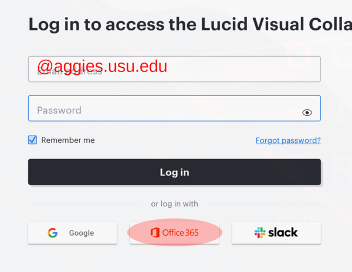
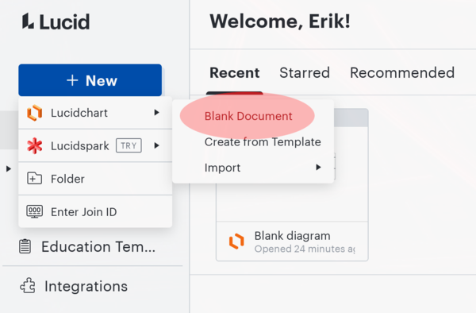
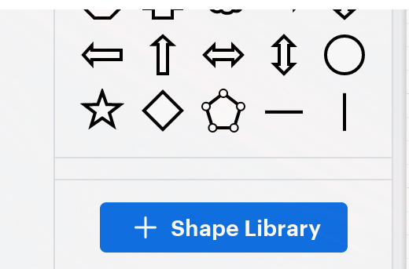
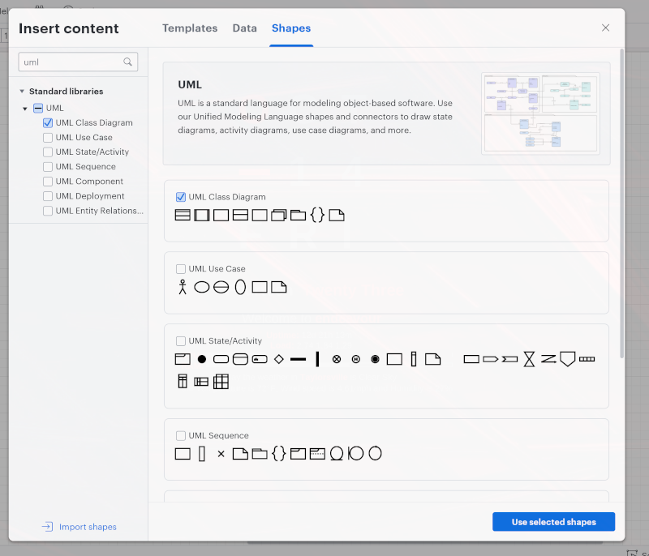
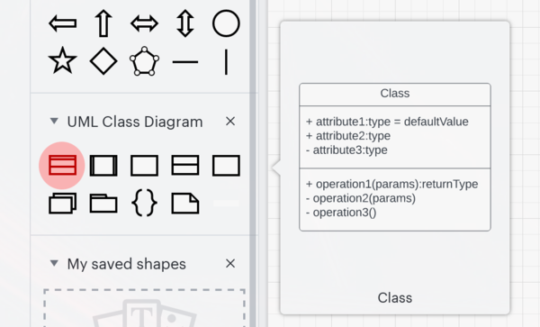
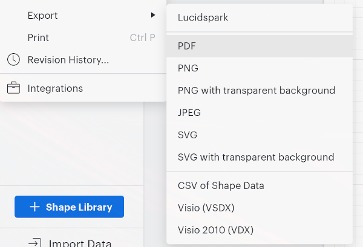

# CS 1440 Assignment 4: Bingo! - Instructions

**Important!**

**I have instructed the CS Coaches to _not_ help you write code for this assignment until you have completed the Design phase and tagged your repository `designed`.  Don't even think about writing code until you have carefully considered the design.  Countless software projects have gone awry because the design phase was neglected.  Don't become a statistic - think first, code after.**

[TOC]


## Description

In this assignment, you will design classes that work together to help users generate a deck of Bingo cards.

Bingo is a simple game where players try to mark all numbers in a row or column or along one of the two diagonals of a Bingo card. The rules of the game of actually not important for this project, as you are only making a program to print the cards.

This program is only partly complete: the finished program will allow a user to create a deck, print a card from the current deck, display the entire deck, or save the entire deck as a text file.  Unit tests are provided, though at this early stage many will fail because the program is still incomplete.


## Previous Semester Assignment Statistics

Statistic                        | Value
--------------------------------:|:---------------
Average Hours Spent              | 10.07
Average Score % (Grade)          | 85.53% (B)
% students thought this was Easy | 17.65%
... Medium                       | 58.82%
... Hard                         | 21.57%
... Too Hard/Did not complete    | 1.96%


## Following the Software Development Plan

Your grade on this assignment depends upon how well you follow the SDP.  You demonstrate this by following instructions, through your documentation, and by *tagging* commits.

-   Incorrectly spelled/capitalized tags are ignored.
-   Make sure that your code does not crash, see [about the assignment penalties](./Rubric.md#penalties) for more information.
    -   Read the [assignment penalties](./Rubric.md#penalties) to know what kinds of problems we are on the lookout for.
-   **If you tag the wrong commit**, refer to `Using_Git/Intermediate_Git.md` in the lecture notes for instructions.

**IMPORTANT: We follow this outline when grading.  You should follow it, too!**  If something listed here is not found in your submission, you *will* lose points.

0.  Tag `analyzed` on the commit at the end of **Phase 1: System Analysis**.  Your work up to this point includes:
    *   Carefully study the [Requirements](#requirements) section below
    *   Study the [SDP](./Cpp_Team_Plan.md) and [UML class diagram](./Cpp_Team_UML.pdf) written by the DuckieCorp C++ team
    *   Read the starter code
    *   `Plan.md`
        *   Phases 0 and 1 are complete.
        *   Filler text is **erased** once your information is filled in.
    *   `Signature.md` is updated, TODO and filler entries are **erased** and replaced with your activity up to this point.
    *   *Grace Points: if the `analyzed` tag is pushed by midnight on the Sunday before the due date, you will receive up to 5 points back from other lost points on this assignment*
1.  Tag `designed` on the commit at the end of **Phase 2: Design**.  Your work up to this point includes:
    *   A first draft of the **User's Manual** describing the expected user interface (UI)
        *   You don't quite have a working UI yet, so this will be your best guess at what using the program will be like
        *   The UI may change as you write code, but you should strive to make the design described by your manual
    *   Create a new UML class diagram as you work on this phase of the Software Development Plan
        *   Save it in a PDF file named `doc/Phase-2-UML.pdf`
        *   Translate the C++ method names to their Python equivalents
            *   `length()` and `size()` become `__len__()` in Python
            *   `operator[]()` becomes `__getitem__()`
            *   `operator<<()` is equivalent to `__str__()`
        *   You may rename the other methods and variables
            *   If you do this, be sure to rename them in the source code as well
        *   You are not limited to using only what is provided in the starter code
            *   You may devise new classes, methods and data members to satisfy the customer's requirements; include these new components on this draft
            *   You may also choose to remove elements from the provided design; that's fine as long as it is **documented**
        *   Do not include `bingo.py` on the diagram - it does not define any classes
        *   Do not include any files related to Unit Tests
            *   If the word "test" appears in the file's name, you may ignore it
    *   Review the **UML Class Diagram** and **Software Development Plan** created by the C++ team
        *   C++ Team [UML Class Diagram](./Cpp_Team_UML.pdf)
        *   C++ Team [Software Development Plan](./Cpp_Team_Plan.md)
        *   Write between **250-300 words** of remarks in `doc/Reviews.md`, answering these questions:
            *   What are your overall impressions about the C++ team's design?
            *   What did you learn from the C++ team's UML Class Diagram?
            *   Did the class diagram help you understand/navigate the source code?
            *   What did you learn from the C++ team's Software Development Plan?
    *   `Plan.md`
        *   Phase 2 includes **clear and easy to read** descriptions and pseudocode for each function/method that you will write in the program (you are not required to write pseudocode for code provided by the instructor).
        *   Phase 4 includes descriptions of the Unit Tests that were written
        *   Filler text is **erased** once your information is filled in
        *   Do not paste Python code into the Plan
        *   Try not to write executable pseudocode; *if we can paste your pseudocode into the REPL and run it, you're doing it wrong*
    *   `Signature.md` is updated
    *   *Grace Points: if this tag is pushed by end of day the Sunday before the due date, you will receive up to 5 points back from other lost points on this assignment*
2.  Tag `implemented` on the commit at the end of **Phase 3: Implementation**.  Your work up to this point includes:
    *   Runnable source code under `src/`
    *   First draft of unit tests written for `Card` and `Deck` classes
        *   Practice Test-Driven Development: at this point in the project these tests will not pass because they code they test hasn't yet been written
        *   These tests are a design tool that help you plan what these classes will do
        *   Follow the notes left by the C++ team in Phase 4 of their software plan
        *   You may need to update these tests as you find and fix problems with your program (or the tests themselves!)
    *   `Plan.md`
        *   Phase 3 **does NOT include copy and pasted code**
        *   Changes from your original plan are noted here, with an explanation of why you changed it
        *   If you did not deviate from your plan, erase the filler text and leave this part blank
    *   `Signature.md` is updated
3.  Tag `tested` on the commit at the end of **Phase 4: Testing and Debugging**.
    *   *This tag may be on the same commit as `implemented`*.  Your work up to this point includes:
    *   `Plan.md`
        *   Phase 4 lists the commands you ran to test your program, with brief descriptions of what a user should expect to see when they run the same commands.
            * Example:
                ```
                Command Ran: <what command did you run in the command line>
                Bug Found: <if a bug was found, what was it? Otherwise note here that it worked as expected>
                Bug Fixed: <if there was a bug, then note here how you fixed it>
                ```
        *   This proves that you tested your program, and lets us replicate your results.
        *   It also tells us what bugs were found and how you fixed them.
        *   Filler text is **erased** once your information is filled in.
    *   `Signature.md` is updated.
4.  Tag `deployed` on the commit that you want us to grade; typically this is the final commit.
    *   *This tag may be on the same commit as `tested` and `implemented`*.  Your work up to this point includes:
    *   `Plan.md`
        *   Phase 5 may be left blank, there isn't much for you to say.
        *   Phase 6 is filled out, organized and easy-to-read.
        *   Filler text is **erased** once your information is filled in.
    *   `Signature.md` has its final update. **There are no more TODOs/filler entries**.
    *   **OPTIONAL** If you have something important tell your grader, write it at the top of the main `README.md`.
        *   Do not request your **Grading Gift** in `README.md` or in commit messages.  Your request must be emailed to the TAs **before** the due date. Please avoid using Canvas messaging, as a proper email helps us track student records much easier.
        *   If you ask for the **Grading Gift** in the `README.md`, we won't see it until it is too late!
5.  The tags `analyzed` and `designed` must be on their own commits; they cannot be together.
    *   The tags `implemented`, `tested`, and `deployed` *may* be on the same commit.
    *   Make sure that each tag has the appropriate file(s) completed/filled out.


## Test-Driven Development

An important part of this assignment is to learn about unit tests and to gain experience approaching a problem through the Test-Driven Development methodology.  Writing your program to comply with the provided unit tests is meant to guide you toward a correct and robust solution, and is worth a large proportion of the points on this assignment.

However, you are given latitude in how your solution is structured and are free to add, remove, or refactor classes to meet the design you crafted in UML.  It is not intended for you to take advantage of this latitude in order to avoid unit tests.

*   10 unit tests are provided in the starter code.  These tests must pass in the final submission
*   2 tests have been identified by the C++ team for the `Deck` class
    *   You must realize these tests by the end of the Testing phase
*   4 tests have been identified by the C++ team for the `Card` class
    *   You must realize these tests by the end of the Testing phase


As you craft your solution, please keep these guidelines in mind:

*   The unit tests that are already provided make some assumptions about the way your code works
    *   My assumptions should not be seen as a "hint" to guide you to the "right way" of writing this program
    *   If your code does not fit my tests, change the tests to match your implementation
        *   If a unit test fails because you renamed a class, method or data member, update the unit test accordingly
        *   If a unit test fails because you removed a class, method or data member, from your design, you must _replace_ that unit test with another non-trivial unit test
        *   If a unit test fails because you moved a piece of functionality from one class to another, move that unit test into the file corresponding to the new class
*   Do not create _trivial_ unit tests
    *   A trivial unit test unconditionally passes, and does not give any insight about your code
*   Do not delete unit tests just because they don't pass; find ways to make your code compatible with the unit test, or re-write the test
*   Do not change unit tests to become less strict or trivial; instead, figure out how to make your code more robust
*   Some of the unit tests can take a *really* long time to run
    *   If you can, seek to improve the performance of your code so that `src/runTests.py` can finish in less than one minute
    *   If you can't make the test run in under a minute, adjust the test parameters downward so the test is less thorough, but still comprehensive

_**TL;DR**_ You have been given 16 non-trivial unit tests.  Your final submission must contain _at least_ 16 non-trivial unit tests that all pass.


## Requirements

### User Interface

0.  DuckieCorp's C++ team completed the `Menu` and `MenuOption` classes before the project was turned over to you
    *   They designed the `UserInterface` class and implemented only those parts they needed
    *   You will notice some bits of C++ style showing through, especially in the names of variables and methods
    *   This naming style is called [Hungarian Notation](https://en.wikipedia.org/wiki/Hungarian_notation)
    *   You can change these if you don't like them, but be careful that you don't add new bugs into otherwise working code!
1.  C++ enforces the privacy of methods and data members within classes
    *   Python has privacy, too, but it's not nearly as strict as languages like C++ and Java
    *   Python variables and methods whose names begin with double underscores `__` are *private*
        *   *Example:* in `src/Menu.py` the attribute `__m_chCommand` is private, as it starts with `__`, but the method `chCommand()` is public.
        *   This **does not** apply to "dunders", identifiers that both *begin* and *end* with underscores - **dunders are public**
        *   It is easy to learn how to defeat these safeguards by inspecting classes in the REPL
        *   Don't take advantage of this and write code that undermines privacy
2.  Follow these general UI principles in this project:
    *   Case doesn't matter; *upper* case is just as valid as *lower* case
    *   You **do not** need to validate file names entered by the user; if the user enters a bad file name, your program should crash with Python's default error message
3.  This program displays menus and prompts the user for input instead of getting arguments from `sys.argv`
    *   Menu options are **case-insensitive**
        *   Note that the starter code displays *upper* case letters for its menus, even though it also accepts *lower* case input!
        *   For consistency's sake, keep to this convention
    *   Prompts are repeated until the user provides valid input
        *   For *string* input, "valid" means that the user typed something, and didn't just hit **Enter**
        *   For *integer* input, "valid" means that the user's input passes the `.isdigit()` test **and** lies within the accepted range
            *   Prompts asking for numeric input *must* display the acceptable range of numbers
    *   Display helpful and appropriate messages to remind the user what kind of input is expected
    *   Continue to redisplay the prompt until valid data is provided
        *   Do not return to the previous menu or exit the program when invalid data is given
        *   Take special care that your program does not get into a bad state when bad data is input by the user; your program should be **robust**


### Bingo Cards

0.  Every Card has a unique integer identifier
    *   This number can be the same as its position within its Deck
1.  A Bingo Card is an $N x N$ grid, where $N$ is the size of the card
    *   The typical size is 5x5, but we'll allow cards to vary in size from 3x3 to 16x16.
2.  Numbers on Cards are drawn from the set of integers $[ 1 \ldots M ]$ (inclusive)
    *   $M$ is the maximum number that may appear in a Deck, its value depends on the size of the Card
    *   $M$ is chosen by the user from the range $[ 2 * N^2 \ldots floor(3.9 * N^2) ]$ (inclusive).
    *   A Bingo number *cannot* appear on the same Card more than once
    *   A Bingo number *can* appear on multiple cards in the same Deck
3.  The columns on a traditional 5x5 Bingo card are named `B`, `I`, `N`, `G`, and `O`
    *   This naming scheme has been extended to accommodate cards with up to 16 columns such that each column has a unique name
    *   Numbers in each column are drawn from $N$ non-overlapping subsets of $[ 1 \ldots M ]$, with values increasing column-wise from left to right
        *   On a 5x5 card, numbers in column `B` are drawn from the first $\frac{1}{5}$th of numbers starting from `1`, column `I` gets the next $\frac{1}{5}$th of numbers, and so on
        *   For a 3x3 card, numbers in column `B` are drawn from the first $\frac{1}{3}$rd of numbers, column `I` gets the next $\frac{1}{3}$rd of numbers, and column `N` gets the last $\frac{1}{3}$rd
        *   This requirement was already fulfilled by the C++ team in the `RandNumberSet` class
        *   However, one of the unit tests indicates that `RandNumberSet` produces duplicate numbers.  **You need to fix this bug.**
4.  Odd-sized cards have a **FREE!** square in the center
    *   **FREE!** squares contain the string `"FREE!"` instead of an integer
    *   Even-sized cards don't have a center square and, thus, no **FREE!** square
5.  Once generated, a Card's appearance does not change
    *   If a Card is displayed multiple times, it's appearance is identical each time


### RandomNumberSet

0.  This class was translated straight across from a C++ implementation, along with the Unit Tests
    *   One of the Unit Tests is failing, indicating that there is still a bug in the code
    *   Find and fix this bug
    *   Besides this bug, you can consider this code to be finished
1.  This class exists to help create Cards that meet the requirements listed above
2.  A Card will *use* a RandomNumberSet object while it is being created
    *   A Card consists of rows of numbers, and the RandomNumberSet is designed to give out one row of numbers at a time
3.  A Card *does not* need to keep its RandomNumberSet after the constructor is finished
4.  Your program *does not* need to make new RandomNumberSets for each Card that is created
    *   RandomNumberSet has a method called `shuffle()` which resets it


### Decks of Bingo Cards

0.  The number of Bingo cards in a Deck is chosen by the user from the range $[ 2 \ldots 8192 ]$ (inclusive).
1.  The `Deck` class must have the following capabilities:
    -   A method to print a specific card in the deck to the screen
    -   A method to print whole deck to the screen
    -   A method to save a deck to a file named by the user
        -   Read the documentation for `open()` to learn how to open a file in **write mode**
        -   It is not your responsibility to check whether the file name the user entered is writable; just let `open()` raise an exception in this case
        -   Read the documentation for `print()` to learn how to print text into a file opened in **write mode**
        -   When you're done saving the deck, don't forget to `.close()` the file!
2.  When printing all a deck's cards to the screen or to a file, simply print every card, one after the other
3.  If you don't change the method definitions already provided for you in `Deck.py`, you should not have to change `UserInterface.py`
    *   You may add new methods and attributes to `Deck.py` as you see fit.
4.  Your solution may contain other classes besides `Deck`. In fact, it should!  If you try to put all the functionality in the `Deck` class your solution will most likely have a poor design. Use the overview given above to identify other meaningful classes.
5.  The deck should be able to retrieve a card given the identifier, so the user can print just that card to the screen.
    *   After a Deck has been created, a card that is displayed multiple times appears identical each time.
6.  When a new deck is created the previous Deck is lost
7.  The program *must not* construct any cards if the user-supplied card size, number of cards, or maximum of Bingo numbers is invalid


### Formatting Output

0.  The Card's ID number is printed first
1.  The name of each column is centered above its cell
    *   Each column is named by a unique letter
    *   You can use these letters `BINGODARLYZEMPUX`
    *   See the [Hints](./Hints.md) for a refresher on centering text in Python
2.  Columns are separated by pipe characters `|`
3.  Rows are bounded by a line of the form `+-----+-----+` that is as wide as the entire Card
    *   There is one boundary line at the top and bottom of every card
4.  Cell contents are centered in a field 5 characters wide
    *   The widest value that can appear in a Card is the string `"FREE!"`
5.  The appearance of Cards is always the same, regardless of whether they are printed to the screen or written to a file

When a card is printed to the screen or to a file, it should be formatted *exactly* like these specimens:

**Odd-sized Card**

```
Card #62
   B     I     N     G     O
+-----+-----+-----+-----+-----+
| 10  | 17  | 35  | 50  | 64  |
+-----+-----+-----+-----+-----+
| 15  | 19  | 44  | 56  | 70  |
+-----+-----+-----+-----+-----+
|  8  | 30  |FREE!| 55  | 63  |
+-----+-----+-----+-----+-----+
| 11  | 26  | 32  | 59  | 67  |
+-----+-----+-----+-----+-----+
|  1  | 23  | 45  | 52  | 62  |
+-----+-----+-----+-----+-----+
```

**Even-sized Card:**

```
Card #10
   B     I     N     G
+-----+-----+-----+-----+
|  8  | 16  | 20  | 27  |
+-----+-----+-----+-----+
|  1  |  9  | 22  | 31  |
+-----+-----+-----+-----+
|  3  | 13  | 19  | 29  |
+-----+-----+-----+-----+
|  7  | 14  | 24  | 26  |
+-----+-----+-----+-----+
```

Examples of every size of Card are found in the [examples](./examples/) directory.


## Tips for writing a User Manual

The User Manual describes only the user interface of the program.  The target audience for the manual is somebody with a little familiarity with computers and no knowledge of the Python programming language.

The manual should answer such questions as

0.  How to run the program
1.  What menus will the user see
2.  What responses should the user give in response to those menus
3.  How to perform the basic operations of the program (in our case, how to create a deck, how to print cards in the deck, how to save a deck to a file, how to quit the program)
4.  What error messages the user may expect, and how to recover from mistakes


The User Manual differs from the Software Development Plan in that it should *not* include details about *how* the program works.  The manual does not need to describe the algorithms and data structures used by the program in order to guide a user in running it.

### Instructions that you do not need to write

You may assume that your user already knows how to

0.  Install the program onto their computer
1.  Open a terminal and navigate to the project directory


## Tips for drawing UML class diagrams

You may draw your UML class diagram any way you prefer, so long as they are *clean* and *legible*.

*   *Clean*
    *   Straight lines
    *   Sharp corners
    *   All lines of boxes connect
    *   Text runs in parallel lines
*   *Legible*
    *   Text is easy to read
    *   Neutral colors that don't distract
    *   Minimize the number of crossed lines

You can even draw your class diagrams by hand, but if you do that they need to look *really* good.

## Drawing UML class diagrams in Lucid

One tool that I recommend is Lucid.  Lucid is a Utah company that makes a powerful and popular online app for creating really nice diagrams.  As a USU student you have a free account on Lucid.  There is a limit on the number of diagrams you can make with the free account.

0.  Visit [Lucid's login page](https://lucid.app/users/login#/login)
1.  Enter your `@aggies.usu.edu` email address, leave the password field empty, and click the **Office 365** button
2.  This will connect you to a new account on Lucid, signing you in with the University's Single Sign On (SSO) system
    *   You may need to authenticate with Duo




Once logged in, click the **+ New** button and choose **Blank Document**



To add UML class diagram shapes to the toolbox click the **+ Shape Library** button



The document will grey out as a modal dialog appears.  Enter `UML` into the search bar, and click the check box next to **UML Class Diagram**, then click **Use Selected Shapes**. 



The UML class diagram shapes are now in your toolbox.

*   Click and drag the 3-compartment class shape from the toolbox onto the diagram
*   Double-click the text in a class to edit the class's name, attributes and methods
*   Connect two classes to each other by hovering over the edge of a shape until an orange dot appears
    *   Click the dot and drag the resulting line until a corresponding orange dot appears on a neighboring shape
    *   Let go of the line once it connects to the other shape
    *   You can change the style of line (solid, dashed) and the type of arrowhead using the menu strip just above the drawing area



See below for details on what types of lines and arrowheads are appropriate to use on your class diagram.


### Downloading your UML class diagram from Lucid

To save and download your UML class diagram, go to **File** -> **Export** then choose **PDF**.  Of all of the available file formats, PDF is the one that causes the least amount of problems for us while grading.



As you write your program in Python code through the latter half of the assignment you will undoubtedly encounter problems you hadn't foreseen.  Update your UML diagrams to match your code as your design changes.


### Drawing UML class diagrams in Diagrams.net

[Diagrams.net](https://app.diagrams.net/) is a simple alternative to Lucid that some may prefer.

0.  Open the website
1.  Click "Create New Diagram"
2.  Select the "Basic" "Blank Diagram"
    *   Don't use one of the pre-defined UML templates, as they start with a bunch of placeholder junk that you'll just end up deleting
3.  Find the UML section in the accordion list on the left-hand side of the screen
    *   There are multiple shapes available with names like `Class`, `Class 2`, `Class 5`, etc.
    *   Make sure that the classes appearing on your diagram have 3 sections as described in our lectures
4.  Download your diagram as a PDF by clicking **File** -> **Export**.
    *   **Do not select _Transparent Background_**
5.  Click **Download** to create the PDF.  Depending on your browser, you may be redirected to a new tab from which you will need to save the file.
